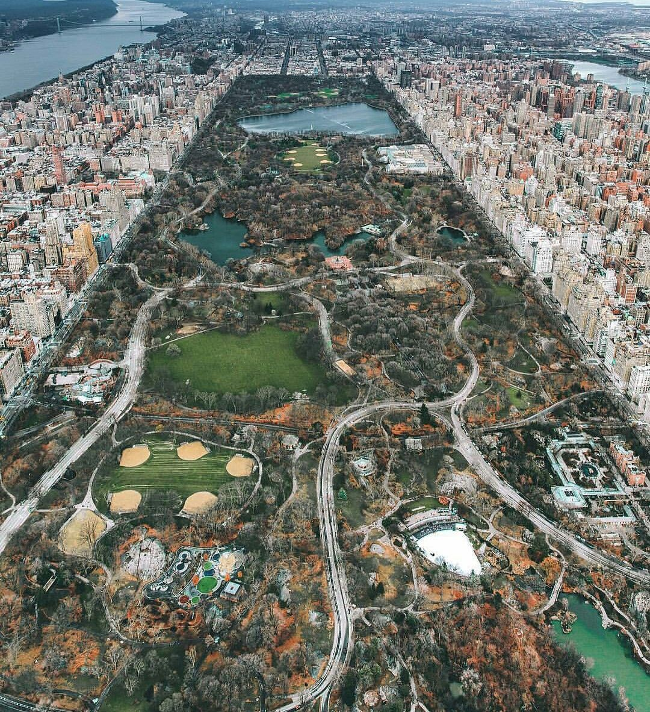

# Cherokee Park
Cherokee Park is a large park located in the Highlands of Louisville, Kentucky. The park was designed by the famous landscape architect Frederick Law Olmsted, most known for designing Central Park in New York City.

