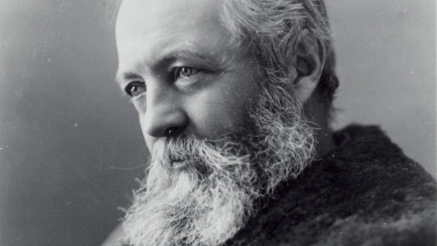
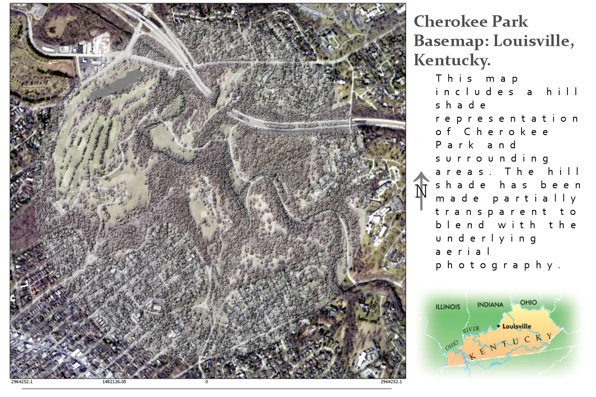
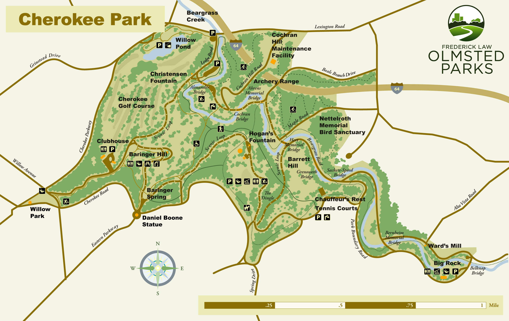
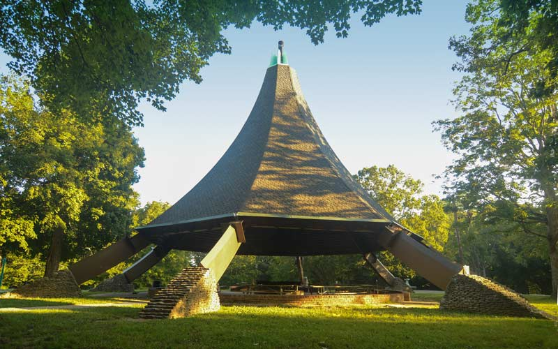
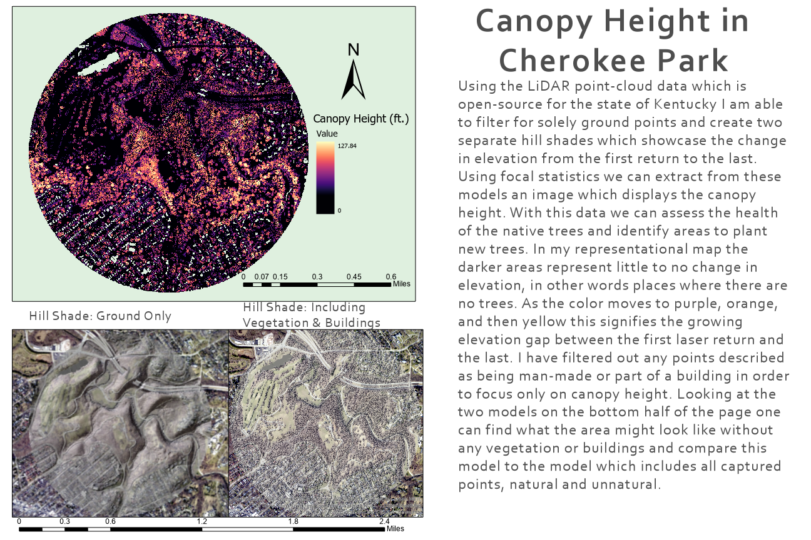
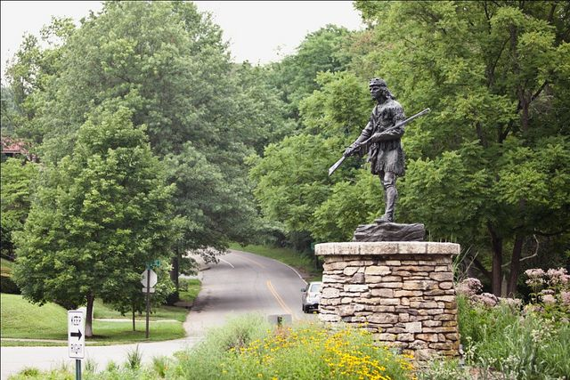
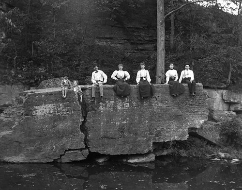

# Cherokee Park
### Cherokee Park is a large park located in the Highlands of Louisville, Kentucky. 

The park was designed by the famous landscape architect Frederick Law Olmsted, most known for designing Central Park in New York City.
      
[Source](http://www.architecture.org/learn/resources/architecture-dictionary/entry/frederick-law-olmsted/)

The goal of this project is to highlight the genius of perhaps the greatest landscape architect our country has known as well as to appreciate of one of his most famous contributions to the city of Louisville. The design of space intended for the public is surely one of the best ways to leave a lasting impact on the world long after you are gone. The state of Kentucky is well known in the field of Geography for the tremendous amount of open source data available on the state. I was able to create this web page through the use of ArcGIS Pro, Github, and open source data such as LiDAR point clouds and aerial imagery. This web page was created as a final project for Advanced GIS, Geography 409 at the University of Kentucky, over the course of the fall semester, 2019. 

## A map of Cherokee Park 
[Source](https://schoolyourbody2.wordpress.com/2015/02/08/visit-the-beautiful-cherokee-park/)

## Hogan's Fountain Pavilion, the center point of my area of interest
[Source](https://historiclouisville.com/hogans-fountain-pavilion/)

## A staute of Daniel Boone at the entrance of Cherokee Park
[Source](https://www.pinterest.cl/pin/435301120203958573/)

## An old photo of some folks sitting on the famous "Big Rock" in Cherokee Park
(https://www.flickr.com/photos/deatonstreet/174647986)